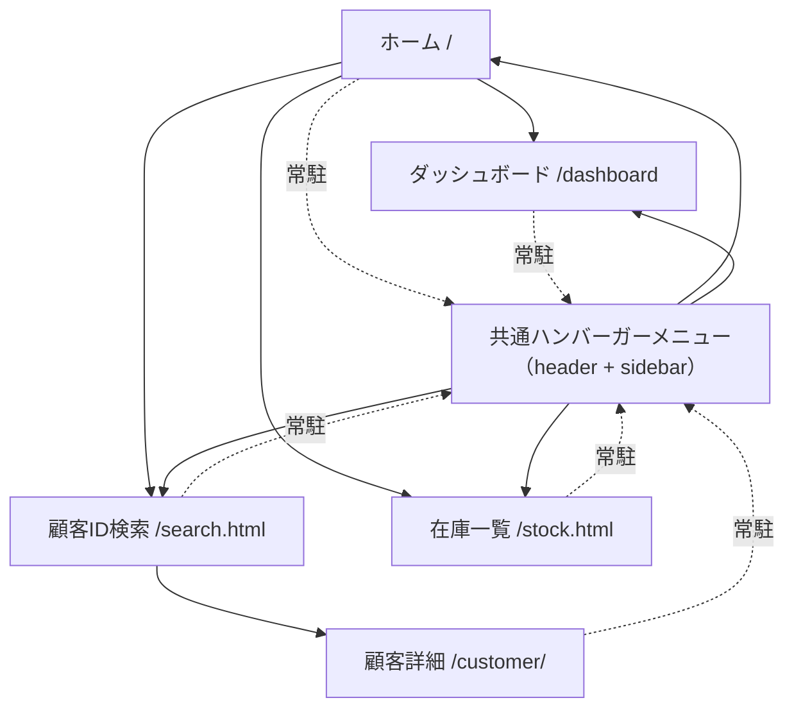

# 📱 画面遷移図（Screen Flow）

本アプリケーションの画面構成と遷移関係をまとめる。

## 画面一覧

- **① ホームページ（/）**
- **② ダッシュボード（/dashboard）**
- **③ 顧客 ID 検索（/search.html）**
- **④ 在庫リスト（/stock.html）**
- **⑤ 顧客詳細ページ（/customer/<id>）**

---

## 画面遷移図

