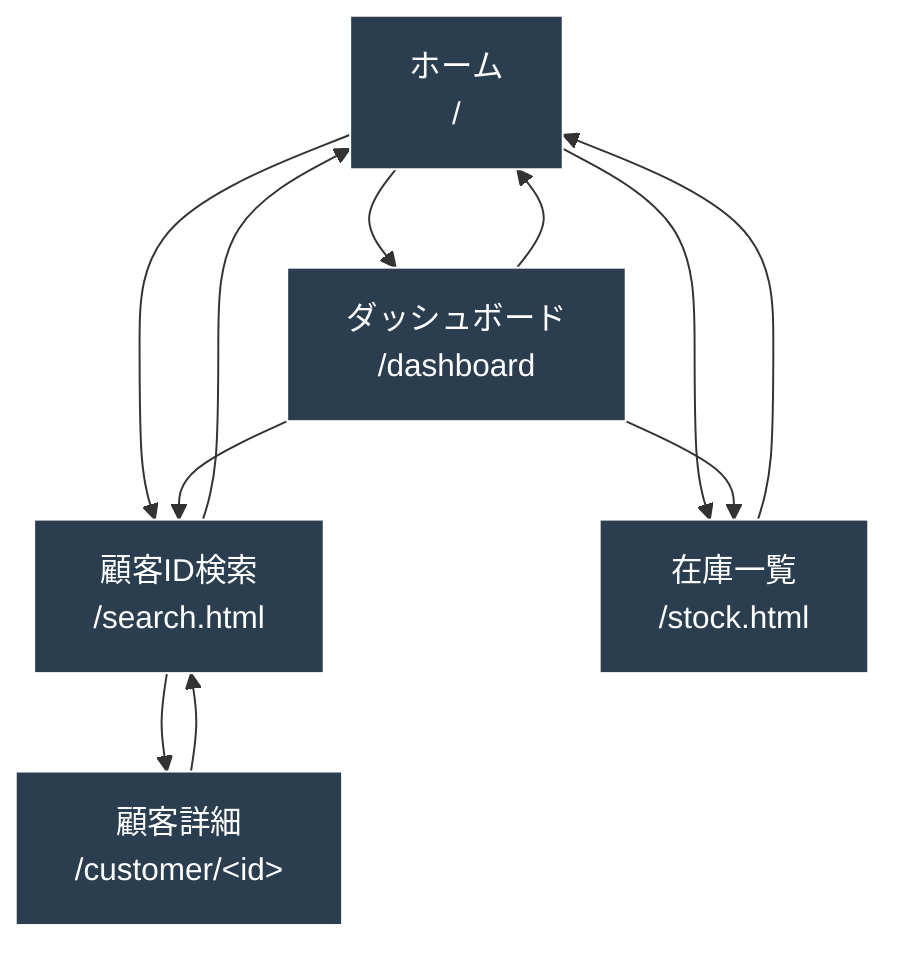

# 📱 画面遷移図（Screen Flow）

本アプリケーションの画面構成と遷移関係をまとめる。
なお、実装上は多くのページが相互リンク可能だが、    
画面遷移図の目的は「主要な導線・典型的なユーザー操作をわかりやすく示すこと」なので、  
本資料では代表的な遷移のみ記載し、詳細な遷移は補足で説明する

## 画面一覧

- **① ホームページ（/）**
- **② ダッシュボード（/dashboard.html）**
- **③ 顧客 ID 検索（/search.html）**
- **④ 在庫リスト（/stock.html）**
- **⑤ 顧客詳細ページ（/customer/<id>.html）**

---

## 画面遷移図

## 🧭 ハンバーガーメニューによる画面遷移について

本アプリケーションでは
**すべての主要画面に共通でハンバーガーメニューが配置されている。**  
このメニューは画面左上に固定表示され、クリックするとサイドバーが展開される。

サイドバーには以下のリンクが含まれており、ユーザーはどの画面からでも即座にページ移動できる。

- **ホームページ（/）**
- **ダッシュボード（/dashboard.html）**
- **顧客ID検索（/search.html）**
- **在庫リスト（/stock.html）**

これにより、ユーザーはページ間を深く遷移した後でも  
**ワンクリックで別機能へ移動できる統一 UI** を実現している。
