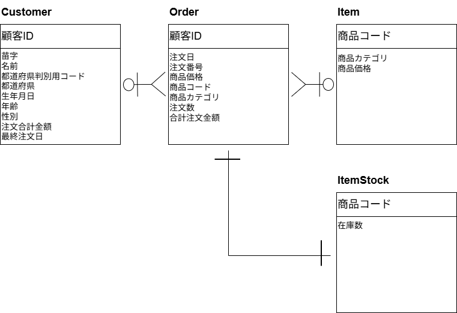

# 📘 テーブル構造（Database Schema）

本アプリケーションで利用しているデータベースのテーブル構造をまとめる。

# 🗺 ER 図（Entity-Relationship Diagram）

下図は本システムで使用しているテーブル間の関連を示す ER 図である。

## 1. cust（顧客情報）

| カラム名        | 型       | 説明                |
|-----------------|----------|---------------------|
| customerid      | str      | 顧客ID（主キー）   |
| lastname        | str      | 苗字                 |
| firstname       | str      | 名前               |
| areacode        | int      | 都道府県判別用コード      |
| area            | str      | 都道府県           |
| birthday        | date     | 生年月日           |
| age             | int      | 年齢               |
| sex             | int      | 性別 (1=男,2=女) |
| totalprice      | int      | 注文合計金額|
| sex             | date      | 最終注文日 |

---

## 2. order（注文情報）

| カラム名        | 型       | 説明                   |
|----------------|-----------|------------------------|
| customerid     | str       | 顧客ID（外部キー）     |
| orderdate      | date      | 注文日                 |
| orderno        | str       | 注文番号               |
| itemprice      | int       | 商品価格                |
| orderitem      | str       | 商品コード |
| orderitemcate  | str       | 商品カテゴリ   |
| ordernum       | int       | 注文数           |
| orderprice     | int       | 合計注文金額 |

---

## 3. itemstock（在庫情報）

| カラム名     | 型   | 説明      |
|--------------|------|-----------|
| item     | str  | 商品コード |
| stock        | int  | 在庫数   |

---

## 4. item（商品マスター）

| カラム名       | 型   | 説明               |
|----------------|------|--------------------|
| item       | str  | 商品コード         |
| itemcate       | str  | 商品カテゴリ       |
| itemprice       | int  | 商品価格             |

---

